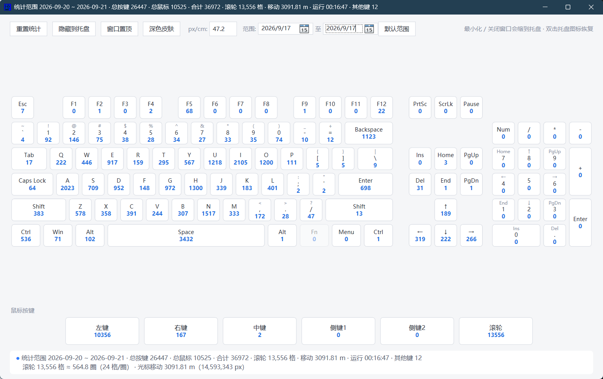
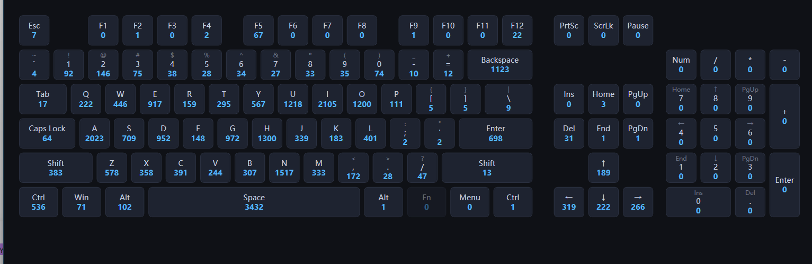
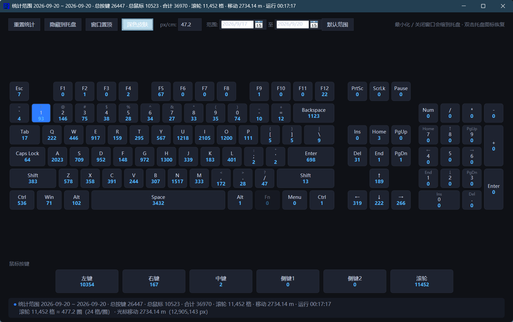

# KeyClickCounter — 键盘鼠标按键统计工具

> 🌏 **语言 / Language：简体中文** ｜ [**English**](README_EN.md)

[](https://dotnet.microsoft.com/)
[](https://learn.microsoft.com/windows/apps/desktop/wpf)
[]()
[](LICENSE)
[](RELEASE.md)

## 📖 项目简介

**KeyClickCounter** 是一个基于 **.NET 10 + WPF** 的 Windows 桌面应用，用于实时统计每天在电脑上的**键盘按键次数**与**鼠标操作情况**：每个按键/鼠标键的累计次数、滚轮格数与圈数、光标移动距离（cm / m）。

程序通过 Windows 全局低级钩子（`SetWindowsHookEx` / `WH_KEYBOARD_LL` / `WH_MOUSE_LL`）采集输入事件，并在高度还原的 **104 键可视化键盘** 上逐键高亮显示实时计数；支持按日期范围查询历史统计、浅色/深色主题切换、系统托盘常驻。统计过程不打断输入、不拦截按键，纯"只读旁观"。

## 🔒 隐私承诺：所有数据均保存在你自己的电脑上

- 所有统计数据只写入本机 JSON 文件：`%APPDATA%\KeyClickCounter\keycount.json`
- **没有任何联网上传、遥测、统计上报或广告**；程序运行时也不与外部服务器建立任何连接
- 程序只"看"按键，不发送、不模拟、不改变任何输入事件
- 彻底清除数据：卸载程序后删除 `%APPDATA%\KeyClickCounter` 目录即可
- 换机 / 备份：将 `keycount.json` 复制到新电脑的相同路径即可 100% 还原全部统计

## 🤖 关于本项目

本项目由 **DeepSeek V4 Flash** 大模型生成：包括项目架构设计、Win32 全局钩子实现、MVVM 视图模型、JSON 持久化方案、界面布局与项目文档，并经过人工审核与真实设备验证。

## 📸 界面预览

**主界面（浅色皮肤）：**



**104 键可视化键盘视图：**



**深色皮肤：**



## ✨ 功能特性

### 全局统计
- **全局低级钩子**（`SetWindowsHookEx`）：任意前台程序下均可捕获键盘与鼠标事件
- **104 键标准布局** + 鼠标 **左 / 右 / 中 / X1 / X2** 独立计数；长按按键只计 1 次（自动去重）
- 按键触发时对应键帽**高亮 200ms**，并实时刷新累计次数；数字过大自动缩写（`k` / `M`）
- **滚轮统计**：累计滚动格数（上下 / 左右滚均按 `|Δ| / 120` 计），并换算圈数（默认 24 格 / 圈）
- **光标移动距离**：钩子内逐段按欧氏距离累加，按 `px/cm` 校准系数换算为 cm / m（<100cm 显示 cm，否则显示 m）
- **px/cm 校准**：自动取系统 DPI / 2.54 作为默认值，工具栏输入框可手动修正
- 罕见键（媒体键等）统一计入「其他键」数量

### 时间维度
- 首次启动即记录统计起始日期，计数**按天分桶**持久化，跨天运行自动归入新的一天
- **日期筛选**：工具栏两个日期选择器可按日期范围查询（默认：首次启动 ~ 今天），状态栏实时显示当前统计范围
- **重置统计**：仅清空当前筛选范围内的数据（默认全部范围），操作前请先备份 json

### 使用体验
- **托盘常驻**：最小化 / 关闭窗口均缩到系统托盘，双击托盘图标或右键菜单恢复
- **托盘菜单**：显示窗口 / 重置统计数据 / 退出程序
- **皮肤切换**：工具栏「深色皮肤」开关即时切换浅色 / 深色主题，选择会随数据持久化（Win32 标题栏颜色也跟随主题）
- **窗口置顶**开关；状态栏实时显示总按键 / 总鼠标 / 合计 / 滚轮 / 移动距离 / 运行时长
- **单实例守护**：重复启动只唤醒已运行窗口，不存在双实例互相覆盖数据的问题

### 数据持久化
- 数据文件：`%APPDATA%\KeyClickCounter\keycount.json`（旧版存于程序目录的数据会自动迁移）
- 每 **30 秒自动保存**，缩到托盘 / 退出 / 系统关机时立即保存；强杀进程最多丢失 30 秒统计

## 🛠 技术栈

| 技术 | 说明 |
| ---- | ---- |
| [.NET 10](https://dotnet.microsoft.com/) | 目标框架 `net10.0-windows` |
| [WPF](https://learn.microsoft.com/windows/apps/desktop/wpf) | UI 框架（`UseWPF`），MVVM 模式 |
| [WinForms NotifyIcon](https://learn.microsoft.com/windows/win32/windows-forms) | 系统托盘图标与右键菜单（`UseWindowsForms`） |
| [P/Invoke + SetWindowsHookEx](https://learn.microsoft.com/windows/win32/winmsg/lowlevelkeyboardproc) | 全局低级键盘 / 鼠标钩子 |
| System.Text.Json | JSON 持久化与旧数据自动迁移 |

## 📁 项目结构

```text
KeyMonitor/
├── KeyClickCounter.slnx            解决方案文件
└── KeyClickCounter/
    ├── KeyClickCounter.csproj     net10.0-windows / UseWPF / UseWindowsForms
    ├── App.xaml(.cs)              应用入口（单实例 + 启动初始化）
    ├── MainWindow.xaml(.cs)       主窗口：可视化键盘 + 托盘行为 + 持久化
    ├── ViewModels/
    │   └── KeyCountViewModel.cs   MVVM 核心：计数 / 高亮 / 汇总 / 重置命令
    ├── Models/
    │   ├── KeyItem.cs             单键模型（INotifyPropertyChanged）
    │   ├── StorageData.cs         持久化模型（首次启动日期 + 按天分桶）
    │   ├── KeyMapping.cs          虚拟键码 → 界面 Id 映射
    │   ├── KeyboardLayout.cs      104 键 + 鼠标键几何布局
    │   └── RelayCommand.cs        ICommand 实现
    ├── Services/
    │   ├── HookService.cs         Win32 全局低级钩子（安装 / 卸载 / 去重）
    │   ├── TrayIconService.cs     WinForms NotifyIcon 托盘
    │   └── StorageService.cs      JSON 持久化 + 旧数据自动迁移
    ├── Themes/
    │   ├── Light.xaml             浅色皮肤资源
    │   └── Dark.xaml              深色皮肤资源
    └── Resources/
        └── KeyboardLayout.xaml    按键样式与 DataTemplate
```

## 🚀 编译与运行

### 环境要求

- Windows 10 / 11（64 位）
- [.NET 10 SDK](https://dotnet.microsoft.com/download)（目标 `net10.0-windows`）
- Visual Studio 2022（17.x+）或 `dotnet` CLI

### 运行

```powershell
dotnet run --project KeyClickCounter
```

### 构建与发布

```powershell
# Debug / Release 构建
dotnet build KeyClickCounter -c Release

# 发布（win-x64，依赖框架）
dotnet publish KeyClickCounter -c Release -r win-x64 --self-contained false

# 发布（win-x64，单文件自包含：目标机无需安装 .NET）
dotnet publish KeyClickCounter -c Release -r win-x64 --self-contained true \
  -p:PublishSingleFile=true -p:IncludeNativeLibrariesForSelfExtract=true
```

也可用 Visual Studio 打开 `KeyClickCounter.slnx` 直接运行 / 发布。

## 🗄 数据存储说明

- 统计文件：`%APPDATA%\KeyClickCounter\keycount.json`
- 内容：首次启动日期、每日各键计数分桶、主题设置、px/cm 校准值等
- 旧版本放在程序目录的 `keycount.json` 会在启动时自动迁移到 `%APPDATA%`
- 换机 / 重装：把备份的 `keycount.json` 放回上述路径即可恢复统计（记录文件格式为 JSON，可直接用文本编辑器查看）

## ❓ 常见问题

- **数据会传到网上吗？** 不会。程序没有任何网络请求，所有数据仅保存在本机 `%APPDATA%\KeyClickCounter\keycount.json`。
- 普通用户权限即可运行；部分全屏游戏（含反作弊系统）内低级钩子可能收不到输入
- 请正常退出程序（托盘菜单「退出程序」），**勿直接强杀进程**，否则最多丢失最后 30 秒统计
- 重置统计为不可逆操作，重置前建议先备份 `keycount.json`
- 如果全局钩子安装失败（被安全软件拦截），程序会弹出提示并继续运行，只是不统计

## 📄 开源协议

本项目基于 [MIT License](LICENSE) 开源。

## 🤝 参与贡献

欢迎提 [Issue](https://github.com/HaoDaYiGuoFan/KeyMonitor/issues) 与 [PR](https://github.com/HaoDaYiGuoFan/KeyMonitor/pulls)！

1. Fork 本仓库
2. 新建功能分支：`git checkout -b feature/xxx`
3. 提交改动：`git commit -m "feat: xxx"`
4. 推送分支：`git push origin feature/xxx`
5. 发起 Pull Request

## 🙏 致谢

- [.NET](https://dotnet.microsoft.com/) 与 [WPF](https://learn.microsoft.com/windows/apps/desktop/wpf) 开源生态
- Windows 平台 [低级键盘 / 鼠标钩子](https://learn.microsoft.com/windows/win32/winmsg/about-hooks) 文档
- **DeepSeek V4 Flash** 大模型：辅助生成本项目的代码、架构与文档